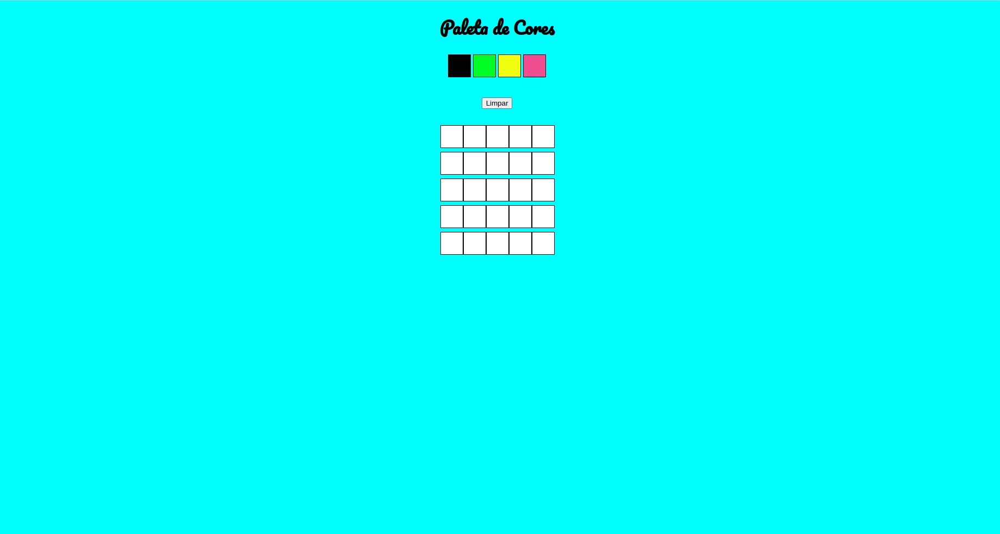

## Project 2 - Fundamentals Module - Pixel Art

---

# Skills and technologies used in this project:

* _HTML 5 
* _CSS 3 
* _JavaScript 

---

## What is the project about?

This project is a pixel game where we train CSS along with JavaScript.
Project under development.

---

# Instructions for running the project:

1. Clone the repository
  * `git clone git@github.com:CrisSouzaMA/trybepixelsart.git`
  * Entre na pasta do repositório que você acabou de clonar:
    * `cd Projeto-2-Pixels-Art`

2. Initialize the project
    * `npm start` (a new page should open in your browser with the project)

---

### To-do List:

- [ ] Refactor
- [ ] Responsiveness
- [ ] Improve css

Bye 🖐️

